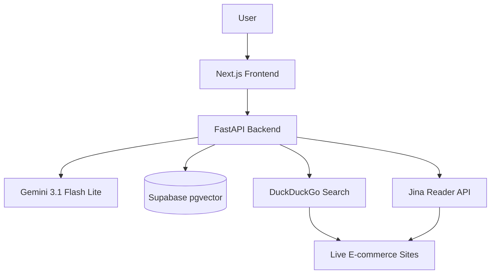

# ShopPilot AI

ShopPilot AI is a production-grade AI-powered shopping assistant that combines a high-performance structured catalog with real-time web enrichment. Built for the modern e-commerce landscape, it demonstrates advanced AI engineering techniques including Hybrid Search, Agentic Tool Calling, and Live Data Extraction.


## Key Features

- **Hybrid Intelligence:** Combines an indexed catalog (Supabase + pgvector) with live, free web extraction (DuckDuckGo Search + Jina Reader).
- **Agentic Reasoning:** Powered by `gemini-3.1-flash-lite`, the agent autonomously decides when to search the catalog vs. scraping live web data.
- **Neural Search:** Implements Hybrid Scoring (Full-Text + Vector Similarity) for ultra-relevant product discovery.
- **Live Enrichment:** On-demand fetching of real-time prices, stock status, and sentiment-aware review summaries.
- **Streaming Interface:** A responsive chat interface with real-time analysis updates.

## Architecture



## Tech Stack

- **Frontend:** Next.js 15, Tailwind CSS, Framer Motion, Lucide React.
- **Backend:** FastAPI, Pydantic, Google GenAI SDK.
- **Database:** Supabase (Postgres + `pgvector`).
- **AI/ML:** Gemini 3.1 Flash Lite (Reasoning), Gemini-embedding-001 (Embeddings).
- **Scraping:** Firecrawl API.

## Getting Started

### Prerequisites

- Node.js 20+
- Python 3.11+
- Supabase Account
- Google AI Studio API Key (Gemini)
- Firecrawl API Key

### Installation

1. **Clone the repository:**
   ```bash
   git clone https://github.com/your-username/ShopPilot.git
   cd ShopPilot
   ```

2. **Backend Setup:**
   ```bash
   cd apps/api
   python -m venv .venv
   source .venv/bin/activate  # On Windows: .venv\Scripts\activate
   pip install -r requirements.txt
   cp .env.example .env
   # Fill in your .env variables
   ```

3. **Database Setup:**
   - Execute the SQL in `apps/api/schema.sql` in your Supabase SQL Editor.
   - Run the indexing script to populate your database:
     ```bash
     cd ../../
     export PYTHONPATH=$PYTHONPATH:$(pwd)/apps/api
     python scripts/index_products.py
     ```

4. **Frontend Setup:**
   ```bash
   cd apps/web
   npm install
   cp .env.example .env.local
   # Fill in your .env.local variables
   ```

### Running the Project

1. **Start the Backend:**
   ```bash
   cd apps/api
   source .venv/bin/activate
   uvicorn app.main:app --reload
   ```

2. **Start the Frontend:**
   ```bash
   cd apps/web
   npm run dev
   ```

## Deployment

### Backend (Render)
1. Create a new **Web Service** on Render.
2. Connect your repository.
3. Render will automatically detect the `render.yaml` file.
4. Set the following environment variables in the Render dashboard:
   - `SUPABASE_URL`
   - `SUPABASE_ANON_KEY`
   - `SUPABASE_SERVICE_ROLE_KEY`
   - `GEMINI_API_KEY`
   - `FIRECRAWL_API_KEY`
   - `ALLOWED_ORIGINS` (e.g., `https://your-app.vercel.app`)

### Frontend (Vercel)
1. Create a new project on Vercel.
2. Select the `apps/web` directory as the **Root Directory**.
3. Vercel will auto-detect Next.js settings.
4. Set the following environment variables:
   - `NEXT_PUBLIC_API_URL` (URL of your Render backend)
   - `NEXT_PUBLIC_APP_URL` (URL of your Vercel frontend)

## License

This project is licensed under the MIT License - see the [LICENSE](LICENSE) file for details.
